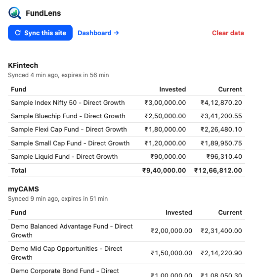
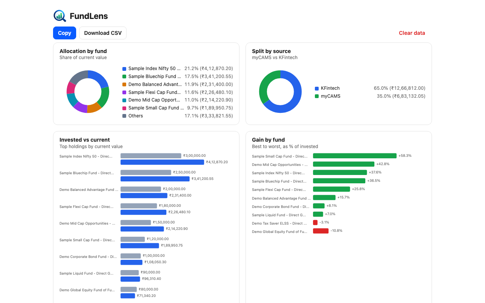

# FundLens

One clear view of all your mutual funds. Private, and stored only in your browser.

A Chrome extension (Manifest V3) that combines your myCAMS and KFintech portfolios.

## Screenshots
| Popup | Dashboard |
| --- | --- |
|  |  |

More: [full dashboard](docs/screenshots/dashboard-full.png), [dark mode](docs/screenshots/dashboard-dark.png), [empty popup](docs/screenshots/popup-empty.png), [Chrome Web Store frame](docs/screenshots/store-popup.png). All screenshots use dummy data.

## Privacy
- Reads only the page you are already logged in to. Never asks for or stores credentials.
- Makes no network requests. Permissions: `storage`, `alarms` (expiry cleanup) and `declarativeContent` (enables the toolbar icon only on myCAMS and KFintech; it reads no page content).
- Data lives only in `chrome.storage.local`.
- Keeps only the latest sync per site and deletes it 1 hour after it was taken.

## Install
1. `chrome://extensions`, enable Developer mode, "Load unpacked", pick this folder.
2. Log in to myCAMS (`newmycams.camsonline.com`) or KFintech (`mfs.kfintech.com`) and reload the page once so the extension attaches.

## Use
- On a portfolio page click the extension icon, then "Sync this site". On myCAMS open the dashboard AMC list first; the extension clicks through each AMC tab and restores your selection.
- The toolbar icon is greyed out on every site except myCAMS and KFintech.
- "Dashboard" opens the full-page view with charts (allocation, source split, invested vs current, gain by fund), gain, share of portfolio and sortable columns.
- Export from the dashboard: "Copy" copies a tab-separated table (`Source, Fund Name, Invested Amount, Current Value`, plain numbers) that pastes straight into cells. "Download CSV" saves the same rows as a file.

## Known limitations
- Do not click around on the page or switch tabs while a myCAMS sync runs (background tabs throttle timers).
- myCAMS active filters and the "zero balance" toggle are respected as displayed (not automated). A scheme filter or hidden zero-balance funds narrows what is read, and an AMC whose funds are all hidden shows as failed.

## Develop
`npm install && npm test`. See `CLAUDE.md` for the code layout and conventions.

Screenshots (`docs/screenshots/`, dummy data only) are regenerated with `tools/screenshots/capture.sh`. It needs Google Chrome on macOS and `python3`; it loads the real popup and dashboard against a fake `chrome.*` API.
 The scrapers are tested against synthetic HTML fixtures in `test/fixtures/`; if a site changes its layout the adapter reports an error and keeps the previous data.

## Author
Varunkumar Nagarajan ([varunkumar.dev](https://varunkumar.dev))
